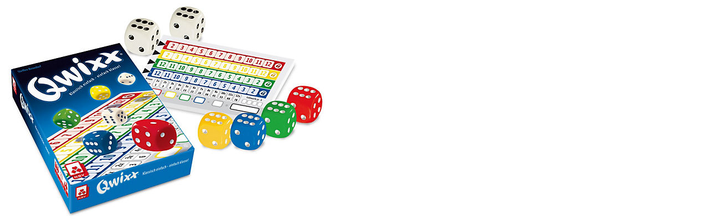
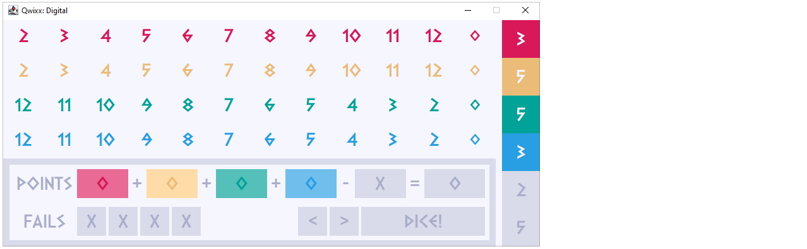
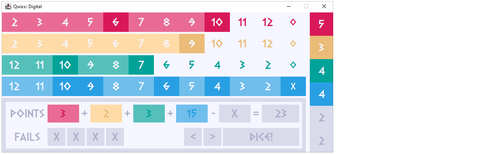

Implementation of the game **Qwixx** for our software engineering project.

By **Joel Merath**, **Tim Disch**

## Links
* Wikipedia: https://de.wikipedia.org/wiki/Qwixx
* Scala: https://docs.scala-lang.org/

# The Game
Qwixx is a dice game with six dice by Steffen Benndorf, which was published in 2012 by Nürnberger-Spielkarten-Verlag. The game was nominated for game of the year 2013 as one of three games, but could not prevail against the game Hanabi. In 2014 Qwixx won the Dutch Games Award.

Illustration of the original game.

## Rules of the game
* Rules: https://www.brettspiele-magazin.de/qwixx/

# The SE-Project

The content of our project was to create the basic functionality of the game. It is possible to play as a single player.
## How to install

To start the game properly, you just have to clone the Gitrepository and install the font in the "setup" folder. The best way to start the game is from IntelliJ.

## Graphical UI

The clear Playground/Block of our game implementation.

A few fields are checked and a row is locked.

## License
[MIT](https://choosealicense.com/licenses/mit/)
