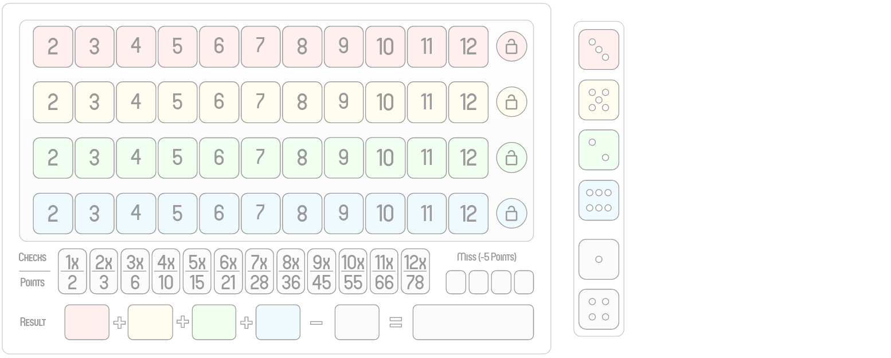

Implementation of the game **Qwixx** for our software engineering project.

By **Joel Merath**, **Tim Disch**

## Links
* Wikipedia: https://de.wikipedia.org/wiki/Qwixx
* Scala: https://docs.scala-lang.org/

## The Game
Qwixx is a dice game with six dice by Steffen Benndorf, which was published in 2012 by Nürnberger-Spielkarten-Verlag. The game was nominated for game of the year 2013 as one of three games, but could not prevail against the game Hanabi. In 2014 Qwixx won the Dutch Games Award.

Concept drawing.

feature/Task09 (GUI).

## License
[MIT](https://choosealicense.com/licenses/mit/)
